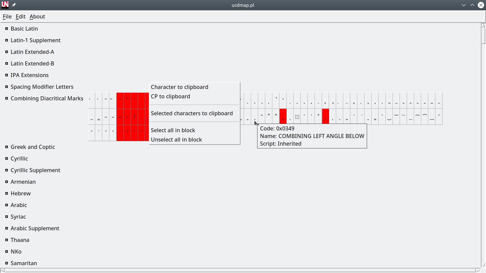

## Description

Unicode character map in Perl/Tk. Note that on the first time the program is
run, a character database is created for quick character name search.

## Requirements

- Tk
- File::ShareDir
- File::ShareDir::Install

## Install

```
perl Makefile.PL
make
sudo make install
```

Or use [AppImage](https://github.com/fluks/ucdmap/releases/download/v0.2.0/ucdmap.appimage-0.2.0-x86_64.AppImage).

## Screenshots



## License

GPL3.
