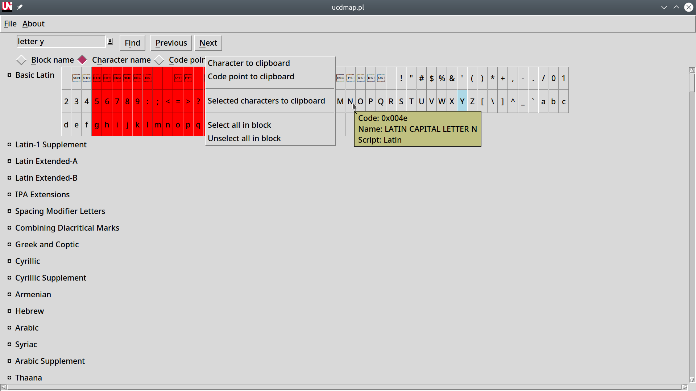

## Description

Unicode character map in Perl/Tk. Note that on the first time the program is
run, a character database is created for quick character name search.

## Install

TODO

## Screenshots

## License

GPL3.
